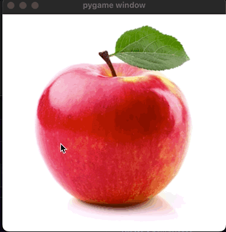

William Marcus

Execution Requirements:

This program requires an image name as the command line argument
An example of how you can execute with the included demo image:
python3 photoManipulator.py apple.jpeg

Functionality:

1. Click anywhere on the image
2. Click anywhere on the image, x > first click, y > first click
3. See the negative of the section you selected
4. Click the 'r' key to undo the previous modification
5. Click the 'a' key to get the negative of the whole image (except if you have made any previous modification, it will be the negative of the whole image except your selection)
6. Use the up and down arrows to rotate rgb (ex: rgb of: 50,75,100 will turn to 100,50,75 after an up arrow)
7. Use the 's' key to save the current manipulated image. This image will be saved as "Saved_Frame.jpg" in the directory you are currently in

See demo below:

